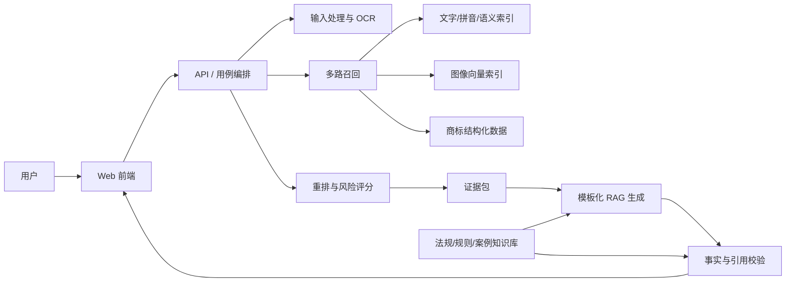

# 系统架构

## 1. 设计原则

采用模块化单体作为 MVP 起点。API、检索、评分、生成和校验在代码上分层，但不急于拆微服务。外部模型、OCR、向量库和文件存储均通过端口接口隔离，避免早期绑定供应商。

## 2. 逻辑组件



## 3. 检索链路

1. 输入规范化：保留原始值，同时生成标准化文字、拼音、类别和图像派生信息；
2. 多路召回：精确/模糊文字、拼音、文本向量、OCR 文字、图像向量分别返回候选；
3. 候选合并：按 `trademark_id` 去重，保留每一路的原始分数和排名；
4. 元数据补全：从结构化库读取类别、商品/服务、状态、申请人和来源；
5. 重排：使用可版本化规则或模型，输出分项分数、综合分和解释码；
6. 风险映射：结合阈值、规则与证据充分度给出提示等级，而非法律定论。

### 评分原则

用户提供的公式目前是不完整示意，且相似度项不应无说明地使用负号。MVP 先采用配置化形式：

```text
similarity_score =
    w_visual   * visual_similarity
  + w_text     * text_similarity
  + w_phonetic * phonetic_similarity
  + w_semantic * semantic_similarity
  + w_category * category_relevance

risk_hint = rules(similarity_score, trademark_status, evidence_quality)
```

约束：各输入统一到 `[0, 1]`；权重、阈值和缺失值策略带版本号；不得把未标定的综合分展示成“法律概率”。在获得标注集前，权重只能视为启发式配置。

## 4. 可信生成链路

生成器只接收“证据包”，不直接访问无边界上下文。证据包至少包括：

- 用户确认的结构化事实；
- 入选商标候选及分项评分；
- 法律资料片段及来源定位；
- 文书类型、模板版本和允许生成的段落；
- 明确的未知字段和禁止推断项。

生成步骤：模板选择 → 逐段检索 → 逐段草拟 → 事实校验 → 引用存在性/适用日期校验 → 全文一致性检查 → 人工复核提示。校验失败时保留告警并阻止标记为“可导出”。

## 5. API 边界（概念版）

- `POST /searches`：创建检索任务；
- `GET /searches/{id}`：读取状态和结果；
- `POST /analyses`：基于已确认候选生成风险分析；
- `POST /documents`：创建文书草稿；
- `GET /documents/{id}`：读取草稿、引用和校验告警；
- `POST /documents/{id}/validate`：重新执行确定性校验。

异步任务、认证和具体字段在 OpenAPI 契约评审后再实现。

## 6. 可观测与可复现

每次运行保存 `request_id`、数据集版本、索引版本、模型/provider 标识、评分配置版本、模板版本和校验结果。日志中不得保存密钥或不必要的原始图片/完整文书。

## 7. 待决策记录

| 编号 | 决策 | 建议默认值 | 触发确认的依据 |
|---|---|---|---|
| ADR-001 | 前后端技术栈 | React + FastAPI | 团队熟悉度与课程要求 |
| ADR-002 | 向量库 | 先定义接口，后选实现 | 数据量、过滤能力、部署资源 |
| ADR-003 | 工作流框架 | 显式编排优先 | 出现持久化状态/恢复需求后评估 LangGraph |
| ADR-004 | OCR/模型提供方 | 不预设 | 中文效果、许可、离线要求与成本 |
| ADR-005 | 法律知识来源 | 仅纳入许可和版本明确资料 | 可引用性、更新机制、课程授权范围 |
