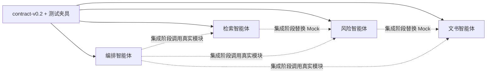

# 四人团队分工与并行开发

> 本文的 Mock 阶段已经完成。当前开发以 `contract-v0.2` 和已实现的 MVP 为基线；v0.1 仅用于理解项目早期并行策略。

## 1. 分工原则

团队按完整业务能力拆分，不按前端、后端、算法和数据库分层。每位成员拥有一个能够独立演示的智能体闭环，包括数据、工具、工作流、API、页面、测试、评测和文档。

智能体负责组织步骤和工具，不替代确定性程序。数据库查询、相似度计算、阈值判断和引用校验应实现为可测试的工具，不能完全交给大模型自由判断。

## 2. 四个智能体

| 负责人 | 智能体 | 完整责任 |
|---|---|---|
| 成员 1 | 案件咨询与编排智能体 | 案件信息收集、任务路由、流程状态、统一工作台、公共组件、系统集成 |
| 成员 2 | 多模态检索智能体 | 数据导入、文字/拼音/语义/OCR/图像检索、多路召回、检索页面与 Recall@K |
| 成员 3 | 风险分析智能体 | 评分规则、法律规则检索、风险解释、风险页面和风险评测 |
| 成员 4 | 可信文书智能体 | 事实表单、模板、分段生成、引用与一致性校验、文书编辑页面和生成评测 |

集成负责人维护视觉规范和公共前端基础。其他成员仍负责自己页面的数据流、状态和交互；最终由集成负责人统一审查，不集中重写全部页面。

## 3. 并行开发模型

并行迭代时的依赖关系：

- 编排智能体只通过公共服务读取 `EvidenceBundle`、`RiskAssessment` 和 `DocumentDraft`；
- 检索智能体只依赖 `CaseContext` 契约；
- 风险智能体只依赖 `EvidenceBundle` 契约；
- 文书智能体只依赖 `RiskAssessment` 和事实快照；
- 任何模块不得直接读取另一个模块的私有数据库表。

## 4. 每位成员的完成定义

一个功能不能只以“模型能返回结果”为完成。每位成员至少提交：

- 一个稳定的输入输出契约；
- 一个 API 入口；
- 一个对应页面或工作台面板；
- 一组可提交的脱敏/合成样例；
- 单元测试和至少一个失败场景；
- 与模块匹配的评测指标；
- 限制、数据来源和演示说明。

## 5. 推荐节奏

### 第 0 天：契约冻结

1. 全员评审 `contracts/v0.2/openapi.yaml`；
2. 确认字段语义、空值、状态和错误格式；
3. 执行 `make validate`；
4. 将评审结果标记为 `contract-v0.2`。

### 第 1–3 天：四路并行

各成员在自己的模块中使用 v0.2 示例和假模型完成回归，每天至少合并一次不破坏契约的小变更。

### 第 4 天：第一次集成

1. 检索真实输出替换 `EvidenceBundle` Mock；
2. 风险真实输出替换 `RiskAssessment` Mock；
3. 文书真实输出替换 `DocumentDraft` Mock；
4. 编排智能体切换到真实调用；
5. 记录字段不兼容和失败恢复问题。

## 6. Git 协作规则

- 分支建议：`feature/orchestration`、`feature/retrieval`、`feature/risk`、`feature/document`；
- 公共契约修改单独提交，不与业务改动混在一起；
- Pull Request 至少由一名非作者成员审查；
- 合并前必须通过契约校验和所属模块测试；
- 禁止向仓库提交密钥、真实用户文件和许可不明确的数据；
- 公共契约发生破坏性变化时创建新版本，不能静默修改旧版本语义。

## 7. 集成负责人的边界

集成负责人负责公共骨架、总体体验和最终联调，但不负责替其他成员补齐其模块的页面、测试和文档。工作量是否均衡由团队自行决定，模块所有权和验收责任不能因此模糊。
