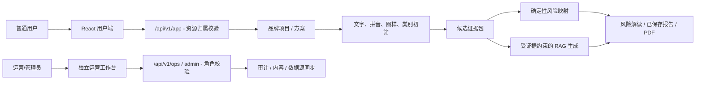

# 架构与可信性答辩要点

## 一张图解释系统

## 老师可能追问的问题

### 为什么不是直接让大模型判断能否注册？

风险分数、等级和证据充分度由确定性检索与规则层生成；模型只能基于已选择的事实和法规证据做解释、问答或文书草拟。这样可减少模型编造事实或把概率伪装为法律结论的风险。

### 多模态体现在哪里？

输入支持名称、类别、业务描述和图样。系统会处理 OCR、图像特征、pHash、文字/拼音/语义线索，再将结果合并为可解释候选。未来重点是“品牌 DNA 卡”和图样证据可视化，而非与任务关联较弱的语音实验室。

### 如何保证用户数据隔离？

用户项目、图样、检索、风险分析、报告和任务均保存 `owner_id`，API 通过当前 token 和资源链路执行归属校验。运维 API 需要 operator/admin 角色；管理员角色调整和导出等操作写入审计事件。

### 报告为什么能再次打开？

报告保存在 `DocumentDraft` 表，包含正文、引用、校验结果、警告、生成方式和事实快照。再次请求同一风险分析时优先返回已有报告；PDF 是对保存草稿的导出，而不是重新调用模型。

### 为什么不能声称完成官方检索？

当前内置的是合成/受控演示数据，检索结果只能用于教学初筛。页面、报告和文档都明确提示正式决策仍需官方查询和专业复核。
